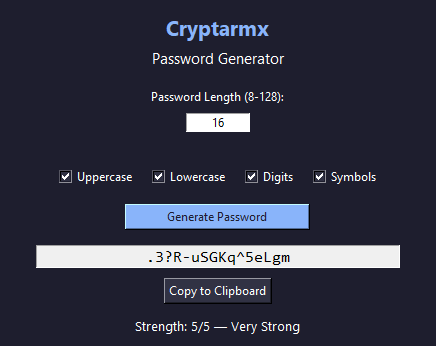

# 🔐 Cryptarmx — Secure, Stylish Password Generator

**Cryptarmx** is an easy-to-use password generator designed to help you create strong, secure passwords on demand.

### ✨ Features

- ✅ Generate strong random passwords (up to 128 characters)
- ✅ Customize character types (uppercase, lowercase, digits, symbols)
- ✅ Evaluate password strength in real time
- ✅ Copy to clipboard instantly
- ✅ Export generated passwords to a `.txt` file
- ✅ Clean and dark-themed professional GUI
- ✅ Cross-platform (Windows/Linux)

### 🔜 Coming Soon

- 🔐 User login
- 🔐 Encrypted password storage with Fernet
- 🗂️ Save passwords to a secure local database
- ☁️ Cloud sync options
- 🧾 Detailed password history
- 🎨 Customizable themes and UI settings

### 📷 Screenshots

!

### 📁 How to Run

1. Clone the Repository

    ```bash
    git clone https://github.com/reuelrmx/Cryptarmx.git
    cd Cryptarmx

2. Install required dependencies:

    ```bash
    pip install -r requirements.txt

3. RUN

    ```bash
    python main_gui.py

